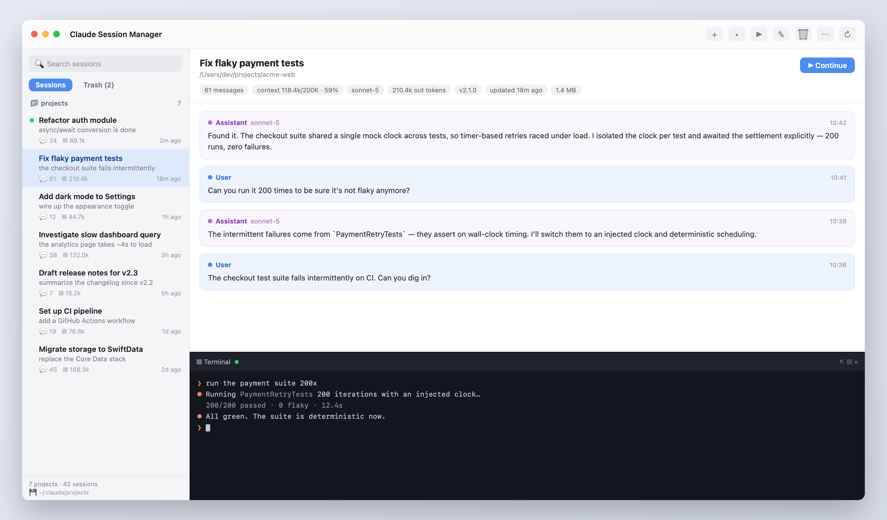

# Claude Session Manager

A native macOS (SwiftUI) app to browse and manage your local Claude Code
sessions — the `.jsonl` transcripts stored under `~/.claude/projects`.

Inspired by [universal-session-viewer](https://github.com/tad-hq/universal-session-viewer),
but a genuinely native Mac app rather than a web viewer.



> The screenshot uses mock data. Regenerate it with `swift docs/make-screenshot.swift docs/screenshot.png`.

## Features

- **Browse** — sessions grouped by project (working directory), sorted by most
  recent activity. Live search across titles, prompts, paths, and branches.
- **View** — full transcript per session: user / assistant turns, thinking,
  tool calls and results (collapsible), plus metadata (model, tokens, git
  branch, version, size, timestamps).
- **Rename** — set a session title. Done safely by appending an `ai-title`
  event (exactly what Claude Code does natively); the message history is never
  rewritten, so the session still resumes correctly.
- **Delete → app Trash** — deleting moves the `.jsonl` into an app-managed
  trash (`~/Library/Application Support/ClaudeSessionManager/Trash`), not the
  system Trash, so it can be managed in-app.
- **Trash tab** — a Sessions / Trash switch at the top of the sidebar. In the
  Trash tab you can preview a deleted session's transcript, **Recover** it back
  to its original location, **Delete Permanently** (single), or **Empty Trash**.
  Each trashed file keeps a `.meta` sidecar recording where it came from.
- **Continue (internal terminal)** — resumes the session in an **in-app
  terminal** (powered by [SwiftTerm](https://github.com/migueldeicaza/SwiftTerm)):
  a real PTY-backed login shell opens in the session's `cwd` and
  `claude --resume <id>` is typed for you. It appears **embedded below the
  transcript** in a draggable split. The pane's ⧉ button **pops it out** into a
  floating window (the process keeps running); the window's **Embed** button
  docks it back. ✕ closes it. One terminal per session. "Open in Terminal.app"
  is still available (context menu) to use the external Terminal instead.
- **Configurable scan folder** — defaults to `~/.claude/projects`; point it at
  any folder and it finds every `.jsonl` beneath it. The choice is remembered.
- **Hides temp sessions** — throwaway sessions that tools spawn in the system
  temp dir (e.g. Claude's `claude-analysis-<uuid>` summarizer logs under
  `$TMPDIR`) are excluded by default. A "N hidden" note appears in the footer,
  and the ⋯ toolbar menu has a *Show temporary sessions* toggle.

## Requirements

- macOS 13+
- Swift toolchain (Xcode or Command Line Tools)

## Build & run

```sh
./build.sh run      # build (release), package the .app, and launch
./build.sh          # build + package only  ->  build/ClaudeSessionManager.app
./build.sh debug    # debug build
```

The packaged app is `build/ClaudeSessionManager.app`. Drag it into
`/Applications` if you want it permanently.

## Project layout

```
Sources/ClaudeSessionManager/
  App/      ClaudeSessionManagerApp.swift   – @main entry, WindowGroup, menus
  Models/   SessionSummary, TranscriptEvent – value types (Sendable)
  Store/    SessionParser                    – JSONL -> summaries / transcript
            SessionStore                     – scans root, holds state, mutations
  Util/     SessionActions                   – rename / delete / continue / reveal
            Formatters                        – dates, bytes, tokens, model names
  Views/    ContentView                      – 3-pane NavigationSplitView
            SessionRow, TranscriptView, RenameSheet
```

## Notes on the session format

Each session is a JSONL file; every line is a typed event. Key types the app
reads: `user`, `assistant`, `attachment`, `system`, plus metadata lines
`ai-title`, `last-prompt`, `mode`, `permission-mode`. The real working
directory and git branch come from `cwd` / `gitBranch` on message lines (the
encoded folder name is ambiguous because path segments can contain `-`).
