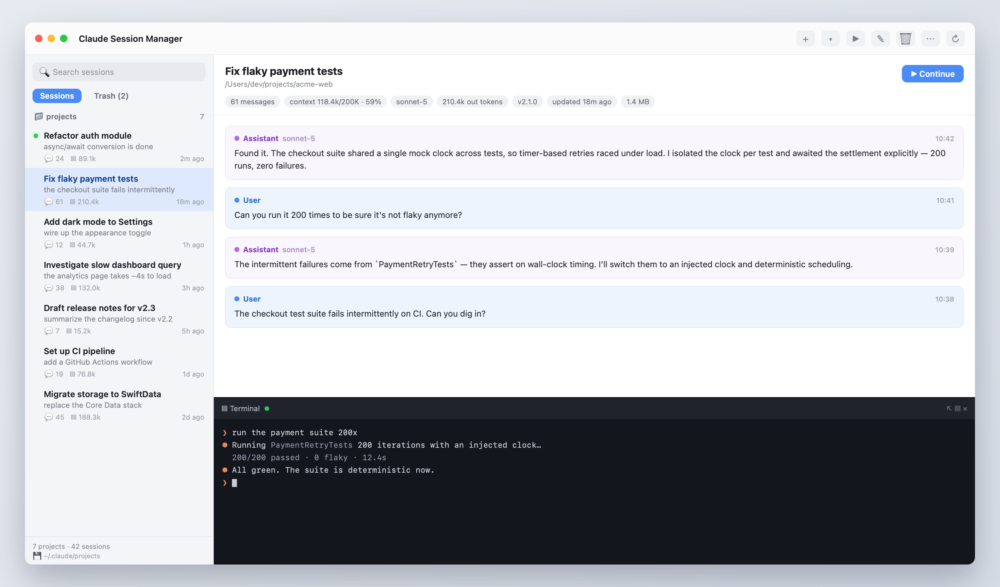

# Claude Session Manager

A native macOS (SwiftUI) app to browse and manage your local Claude Code
sessions — the `.jsonl` transcripts stored under `~/.claude/projects`.

Inspired by [universal-session-viewer](https://github.com/tad-hq/universal-session-viewer),
but a genuinely native Mac app rather than a web viewer.



> The screenshot uses mock data. Regenerate it with `swift docs/make-screenshot.swift docs/screenshot.png`.

## Install

### Homebrew (recommended)

```sh
brew tap jeromezliu/tap
brew install --cask claude-session-manager
```

Homebrew verifies the download's checksum and strips the quarantine flag, so the
app launches without a Gatekeeper prompt. If Homebrew asks you to trust the tap
on first use, run `brew trust jeromezliu/tap`.

Update or remove later:

```sh
brew upgrade --cask claude-session-manager
brew uninstall --cask claude-session-manager
```

### Manual download

Grab the latest `.zip` from the
[Releases](https://github.com/jeromezliu/claude-session-manager/releases) page,
unzip it, and move `ClaudeSessionManager.app` to `/Applications`. The app is
ad-hoc signed (not notarized), so on first launch **right-click → Open** (or run
`xattr -dr com.apple.quarantine /Applications/ClaudeSessionManager.app`).

### Build from source

```sh
git clone https://github.com/jeromezliu/claude-session-manager
cd claude-session-manager
./build.sh run      # build (release), package the .app, and launch
```

`./build.sh` alone builds and packages to `build/ClaudeSessionManager.app`;
`./build.sh debug` makes a debug build.

## Requirements

- macOS 13 (Ventura) or later
- The `claude` CLI on your `PATH` — required for the **Continue** feature
- `ssh`/`rsync`/`scp` on your `PATH` — only needed for the **Remote hosts**
  feature (connection details are configured in the app itself)
- To build from source: the Swift toolchain (Xcode or Command Line Tools)

## Features

- **Three-column layout** (like Mail) — the sidebar holds *All Sessions*,
  *Skills*, *Trash*, your categories, groups (colored dots, like Finder tags)
  and projects; the middle column lists the selection's sessions newest first;
  the right shows the transcript. Organize the sidebar by group or by project
  from the toolbar. Search (toolbar) looks across all sessions: titles,
  prompts, paths, branches, and group names.
- **Groups** — the sidebar groups you made in the Claude desktop app show up
  automatically (read-only: the desktop's files are never written). Right-click
  any session(s) → *Move to Group* to file it under a desktop group or a new
  group of your own; groups created here can be renamed or deleted from their
  header's context menu, and a local assignment overrides the desktop's.
- **Categories** — a top level above groups and projects: right-click a group
  or project → *Move to Category* → *New Category…* to file it under, say,
  *Customers* or *Home*. Selecting a category lists all of its sessions. They
  apply in both the by-group and by-project layouts; collapsed state is
  remembered.
- **Drag & drop** — drag sessions from the middle column (the whole
  selection, if the dragged one is selected) onto a group to file them there,
  onto *Ungrouped* to take them out, or onto *Trash* (asks first); drag a
  group/project onto a category (or any row inside it) to move it in, or onto
  the *Groups*/*Projects* header to move it back out.
- **Tidy desktop sessions** — desktop sessions use the desktop app's titles;
  worktree sessions (`<repo>/.claude/worktrees/<name>`) are listed under their
  repository; folder-less "scratch" sessions share one *Scratch* section; and
  injected text (`<system-reminder>`, task notifications, slash-command tags) is
  stripped from titles, previews and transcripts. Sessions archived in the
  desktop app are hidden unless *Show archived sessions* is on.
- **Multi-select** — ⌘/⇧-click to select several sessions and move them to the
  Trash in one go.
- **Session overview** — the detail pane opens on an *Overview*: the desktop
  recap (or Claude's latest reply), *Your Requests* (every prompt, newest first;
  click one to jump to it), *Outputs* (PRs, files handed to you, files changed —
  all clickable) and a few stats (span, tokens, context, compactions). Other
  details (session id, models, version, …) sit behind the ⓘ button.
- **Conversation** — the *Conversation* tab reads top to bottom (opening at the
  newest turn) with Markdown rendered — headings, lists, code, quotes, tables;
  each stretch of tool work is folded into one line (e.g. "12 tool calls · Bash
  ×8, Edit ×3") that expands to the calls. Attachments and system events are
  hidden unless toggled on.
- **Token usage** — a header chip shows context usage vs the model's window
  (e.g. `context 89.1k/1M · 45%`), read from Claude's own per-turn usage.
  Window is configurable (Auto / 200K / 1M) in the ⋯ menu.
- **Continue in an embedded terminal** — resumes the session in an in-app
  terminal (via [SwiftTerm](https://github.com/migueldeicaza/SwiftTerm)): a
  PTY-backed login shell opens in the session's `cwd` and runs
  `claude --resume <id>`. It sits in a split below the transcript; **pop it out**
  to a floating window or **expand** it full-height, and dock it back.
  "Open in Terminal.app" is also available from the context menu.
- **New session** — start a fresh `claude` session in any folder right from the
  app (➕ toolbar button, with a remembered default directory).
- **Activity indicator** — a pulsing dot marks sessions whose terminal is
  actively producing output.
- **App-managed Trash** — deleting moves the `.jsonl` to an in-app trash
  (`~/Library/Application Support/ClaudeSessionManager/Trash`). Recover it to its
  original location, delete permanently, or empty the trash — from the Trash tab.
- **Rename** — set a session title safely by appending a `custom-title` event
  (exactly what `/rename` does); the message history is never rewritten, so
  the session still resumes correctly.
- **Auto-refresh** — the list and open transcript update live as sessions change
  on disk; no need to relaunch.
- **Version** — the running version is shown at the bottom of the ⋯ menu (and
  in *About*); local builds read e.g. `1.3.0+2.c982008` (2 commits past v1.3.0).
- **Hides temp sessions** — throwaway sessions tools spawn in `$TMPDIR` (e.g.
  Claude's `claude-analysis-<uuid>` logs) are hidden by default, with a
  *Show temporary sessions* toggle and a "N hidden" note in the footer.
- **Configurable scan folder** — defaults to `~/.claude/projects`; point it at
  any folder and it finds every `.jsonl` beneath it. Remembered across launches.
- **Remote hosts** — browse and manage Claude sessions on a remote/cloud-shell
  machine reachable over SSH. Configure a host entirely in-app (⋯ menu →
  *Manage Remote Hosts…*): hostname/IP, port, username, and either a private
  key / certificate file or a password. Passwords are stored in the macOS
  Keychain (never on disk) and supplied to `ssh`/`rsync`/`scp` via an
  `ssh-askpass` helper; key auth can also fall back to your default keys and
  ssh-agent. The app mirrors each host's `~/.claude/projects` into a local
  cache via `rsync` and shows those sessions alongside local ones, tagged with
  the host name. **Continue** opens an `ssh`-backed embedded terminal instead of
  a local shell; **New Session** can start a fresh `claude` session in a
  directory on the host; rename and delete/trash work the same as locally,
  mutating the file on the host over SSH. Requires `ssh`/`rsync`/`scp`.

## Project layout

```
Sources/ClaudeSessionManager/
  App/       @main entry, window, menus
  Models/    SessionSummary, TranscriptEvent, TrashEntry, RemoteHost (Sendable value types)
  Store/     SessionParser     – JSONL → summaries / transcript
             PromptText        – strips harness-injected tags from user text
             SessionStore      – scans local + remote roots, mutations, auto-refresh
             SessionGroups     – group/project sidebar sections, local groups & titles
             DesktopMetadata   – read-only view of Claude Desktop titles & groups
             SummaryCache      – mtime/size-keyed parse cache
             TrashManager      – app-managed trash (move / recover / purge)
             RemoteHostStore   – remote host config, rsync mirroring, connection test
  Terminal/  TerminalSession, TerminalManager, TerminalActivity (SwiftTerm)
  Util/      SessionActions, Formatters, FileWatcher, DirectoryWatcher, RemoteShell
  Views/     ContentView (2-pane split), SessionRow, TranscriptView,
             TerminalViews, RenameSheet, RemoteHostViews
Icon/        GenerateIcon.swift (CoreGraphics app-icon generator)
docs/        make-screenshot.swift (README screenshot renderer)
```

## Releasing (maintainers)

```sh
./release.sh 1.1.0
```

Builds and zips the app, bumps the Homebrew cask (version + `sha256`), publishes
a GitHub release with the zip, and updates the [tap](https://github.com/jeromezliu/homebrew-tap).
Run it with the account that owns the public repo/tap; it restores your previous
`gh` account afterward. Set `SYNC_PRIVATE_REMOTE=origin` to also push to a
private mirror.

## Notes on the session format

Each session is a JSONL file; every line is a typed event. The app reads
`user`, `assistant`, `attachment`, and `system` events, plus metadata lines
(`custom-title`, `ai-title`, `last-prompt`, `pr-link`, `mode`, `permission-mode`). The real working
directory and git branch come from `cwd` / `gitBranch` on message lines — the
encoded folder name is ambiguous because path segments can contain `-`.

One important detail the app relies on: the embedded terminal strips inherited
`CLAUDECODE` / `CLAUDE_CODE_*` / `ANTHROPIC_*` environment variables before
launching `claude`, so the resumed session runs as a normal top-level session
and persists its transcript (a nested/child session would not).
